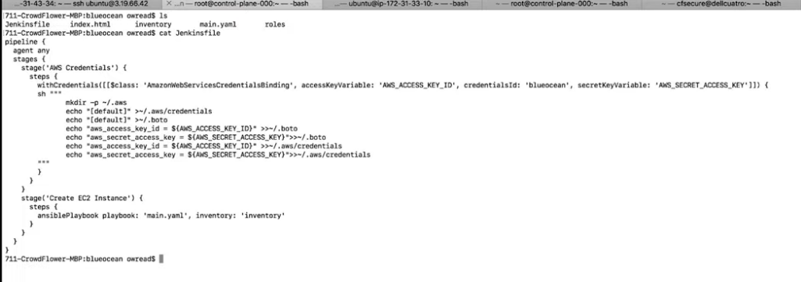
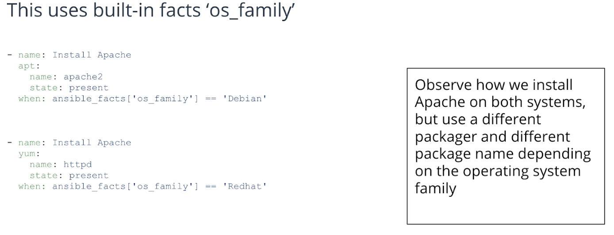

# Cloud DevOps Engineer - Continuous Integration and Continuous Delivery

## Course Overview

Our main focus will be on CI/CD and pipelines in the first two lessons of this course. Next we will move to configuration management using Ansible, and we will conclude with monitoring and log aggregation.

The idea for you as a student is to be able to develop the skills needed to: a) create an environment from code (infrastructure as code) with Ansible; b) create a development pipeline on this infrastructure with Jenkins; and c) monitor and maintain this infrastructure through the use of monitoring, metrics, and log analytics using Prometheus and ELK stack.

One of the beautiful things about the field of DevOps is the flexibility and interoperability of the different components, which can be compared to Lego pieces. In these lessons we will start to understand how the building blocks of development, monitoring, and deployment fit together and complement each other.

It should also be noted that we are endeavoring to use some of the most common representations of these technologies. There are many very similar, but different, pieces of software which perform the same or similar tasks. When will discuss some but not all of these alternatives.

## Intro to Jenkins

* Introduced in 2011
* Replaced Hudson

The new cutting-edge jenkins technology is **Jenkins-X**:
* Jenkins for Docker and microservices
* Integrates with Kubernetes
* Released but still in development.

### AWS Setup

To manage the pipelines, we will create a new user only with the permissions that it actually needs, following a restrictive model (minimum permission model) as a best practice.

We create a new user Jenkins with EC2 and S3 policy access. Moreover, when creating the EC2 instance to install Jenkins in, check the access policy created to allow both ports 22 and 8080 (Jenkins dashboard) only from "My IP".

To install Jenkins in the new instnace:

```bash
sudo apt-get update
sudo apt install -y default-jdk
wget -q -O - https://pkg.jenkins.io/debian/jenkins.io.key | sudo apt-key add -
sudo sh -c 'echo deb https://pkg.jenkins.io/debian-stable binary/ > /etc/apt/sources.list.d/jenkins.list'
sudo apt-get update
sudo apt-get install -y jenkins
```

Run it via `sudo service jenkins start`.

### BlueOcean

BlueOcean is a Jenkins plugin that provides a re-skinned for working with Jenkins:

    Optimizes GUI for pipelines
    Re-skins Jenkins to make management easier
    Has built-in diagnostics


Continuous Integration (CI) is a development practice where developers integrate code into a shared repository frequently, preferably several times a day. Each integration can then be verified by an automated build and automated tests. Source: https://codeship.com/continuous-integration-essentials

Continuous deployment (CD) is a strategy for software releases wherein any code commit that passes the automated testing phase is automatically released into the production environment, making changes that are visible to the software's users https://searchitoperations.techtarget.com/definition/continuous-deployment

### Pipelines Overview

One of the key best practices of DevOps is to be able to do “Infrastructure as Code”. A pipeline enables us to store our Jenkins project configuration as code in a Git repository.

The previous way of doing this was to store the configurations as text on the Jenkins server. However, it is far superior to store this in a Git repository, because that way we version it, review it, perform pull requests, and integrate it just like the rest of our code.

A pipeline contains steps which have different actions performed as part of those steps.

## BlueOcean

Blue Ocean Setup Summary

    One repo per project
    Git repos can be re-used in multiple pipelines
    Make Jenkins become IasC (Infrastructure as Code)

### Development and Staging Pipeline Summary

    Development pipelines are kicked off very frequently and with continuous deployment will automatically update servers
    Staging is where QA will test the environment so this needs to be kept more static to prevent interruptions

### Multi-Pipeline Summary

    There is no limit on the number of pipelines you can have.
    Optimize for your environment - every setup is different.
    Be careful with continuous deployment because you may overwrite the wrong thing.

### Pipeline Triggers

    When code is pushed to the Git repository after a pull request, build automatically, i.e. continuously integrate
    If the tests in a pipeline pass, deploy the code, i.e. continuously deploy

### Pipeline Testing

    Linting is testing to check for syntax errors in code.
    Security testing can be performed with a variety of software to test for CVE vulnerabilities.
    Performance testing is done by setting up a smaller scale environment than production with Jenkins and running simulated host calls into that environment to see how it performs under load.
    Integration testing is testing code from different modules to make sure it all works together.


`sudo apt-get install tidy`. Test with `tidy -q -e index.html`.

### Security Testing with Aqua

Aqua is a Jenkins plugin designed for testing Docker containers. It is one of many security vulnerability scanners available, testing against CVE (Common Vulnerabilities and Exposures).

We’ll install and show how to use Aqua next.


    Aqua is used for scanning Docker containers for CVE
    Aqua depends on Docker
    Aqua can be integrated into a testing pipeline in the Continuous Integration stage

Install docker with `sudo apt-get install docker.io`. Give jenkins and docker symbiotic permissions: `sudo usermod -aG docker jenkins`.

Then, we need to put the Aqua scanner credentials to Jenkins in "Configure System". Finally, we need to configure docker in "Global Tool Configurations". We'll set the version number for "Name" and the location, usually `/usr/bin/`.

### Further Research on Testing

If you’d like to look into other types of tests, here are some resources:

    Performance Testing: https://opensource.com/life/16/7/running-jmeter-jenkins-continuous-delivery-101
    Integration Testing: https://www.twilio.com/engineering/2017/01/09/how-to-setup-a-ci-build-for-integration-tests

### Deployment Strategies - Blue/Green Deployment

* `sudo apt-get install ansible`
* `pip install boto`
* Install Jenkins plugin CloudBees AWS Credentials Plugin
* Configure AWS credentials in Jenkins: Jenkins > Credentials > Global > Add Credentials > AWS Credentials
* Map Credentials from Jenkins to Pipeline application

In Jenkins file: 


Also, we need to setup the policy with the following configuration (we'll add this in the minimum_security_policy we already created.)

```json
{
    "Version": "2012-10-17",
    "Statement": [
        {
            "Sid": "VisualEditor0",
            "Effect": "Allow",
            "Action": [
                "s3:*",
                "cloudwatch:*",
                "route53:*",
                "ec2:*",
                "ec2:DescribeAccountAttributes",
                "elasticloadbalancing:*"
            ],
            "Resource": "*"
        },
        {
            "Sid": "VisualEditor1",
            "Effect": "Allow",
            "Action": "iam:CreateServiceLinkedRole",
            "Resource": "arn:aws:iam::*:role/aws-service-role/*"
        }
    ]
}

```

* Setup Private Route53 Zone
* Configure Healthcheck
* Run Blue deployment
* Run Green deployment
* Check Route53 entries

### Deployment Strategies Guide

    Manual changes will get you in trouble sooner or later.
    New feature code releases often require blue/green deployment due to scheme changes and/or to keep consistency.
    To perform a bug fix of an existing product, a rolling deployment will be your most frequent choice.

To deploy a bug fix, what type of deployment is most appropriate? Rolling Deployment
When releasing a new feature, what type of deployment is safest? Blue/green

### Practice Exercise 1

Working through these exercises will give you valuable practice for your project work!

To practice your skills with deployment and pipelines, please do the following:

    Set up a “Hello World” pipeline in Blue Ocean.
    Screenshot a successful run and compare it to my screenshot below.

The code for a “Hello World” pipeline is shown here:

```
pipeline {
  agent any 
  stages {
    stage(‘Build’) {
      steps {
        sh ‘echo “Hello World”’
        sh ‘“
                  echo “Multiline shell steps works too”
                  ls -lah
               “‘
      }
    }
  }
}
```

### Practice Exercise 2

    Install “lint” onto your Jenkins Master. This is to check the HTML code for malformed tags. sudo apt install tidy
    Set up a Lint job.
    Capture a screenshot after a successful Lint check of your html code, and compare it to the screenshot below.
```
    pipeline {
      agent any
      stages {
        stage(‘Lint HTML’) {
          steps {
            sh ‘tidy -q -e *.html’
          }
        }
      }
    }
```

### Practice Exercise 3

    Install Jenkins plugin AWS CodePipeline.
    Set up your AWS credentials with your access key and secret access key in Credentials.
    Create your S3 bucket (must be unique).
    Set up your pipeline. Note: your bucket name can’t be the same as mine.
    Screenshot a successful run and compare it to mine below.

Here is the Pipeline code for performing the Tidy check:

```
pipeline {
    agent any
    stages {
      stage(‘Lint HTML’) {
        steps {
          sh ‘tidy -q -e *.html’
        }
      stage(‘Upload to AWS’) {
        steps {
          withAWS(region:’us-east-1’,credentials:’blueocean’) {
            s3Upload(pathStyleAccessEnabled:true, payloadSigningEnabled: true, file:’index.html’, bucket:’c3pipelines’)
          }
        }
      }
    }
}
```

## Ansible

*Yet another DSL (domain specific language)*

Here’s what you’re going to learn in this Ansible lesson:

    Ansible overview
    Configuration management philosophy
    How to install/update software with Ansible
    What are templates and how to use them
    Managing services with Systemd
    Controlling when actions are taken conditionally
    Classification of machines for conditionals
    How to create and manage roles
    What is an inventory file
    Ansible file structure

### Ansible Overview

    Leverages YAML (yet another modeling language) and JSON (Javascript object notation)
    Agent-less language which uses SSH (secure shell) to connect to servers
    Light-weight, but managing large clusters is slow
    Written in Python, Ruby and Powershell

### Configuration Management Desired State

Idempotency: “The property of certain operations in mathematics and computer science whereby they can be applied multiple times without changing the result beyond the initial application.” Source: https://en.wikipedia.org/wiki/Idempotence

### Templates

    Ansible templates enable you to apply configuration files which are customized to fit the application
    Variables are abstracted using the format: {{ VARIABLE_NAME }}

Templates Example Code

File: repo.conf.j2

```jinja
server {
        listen   80;
        server_name  {{ SERVER_NAME }};
        root   {{ REPO_PATH }};
        location / {
                index  index.php index.html index.htm;
                autoindex on;    #enable listing of directory index
        }
}
```

Apply template:
```ansible
- name: generate all configmap configs
  template:
      src: repo.conf.j2
      dest: /etc/nginx/conf.d/repo.conf
      owner: root
      group: root
      mode: 0744
```

### Services

We can also use Ansible to run systemd services


### Conditions

Conditionals Register

Set an Ansible variable to the output of the module

```ansible
- name: How long has the server been up
  shell: uptime
  register: sys_uptime
```



Built-in Ansible Variables

    To see every built-in variable for the system you are using (every host is different) (change localhost to the host you are checking): $ ansible -m setup localhost
    Some common ones:
        ansible_hostname
        ansible_all_ipv4_addresses
        ansible_architecture
        ansible_kernel

### Roles

A role is a collection of tasks bundled together.

File Structure of a Role

Each role is contained in a subdirectory: roles/name_of_role

Containing additional directories:

    Tasks
    Templates
    Vars
    Files

To include a role:

```ansible
  - name: Initialize Vault Server
      include_role:
        name: vault
```

### Running Ansible

Executing a playbook.

When orchestrating the execution of tasks on servers what do we use? Inventory

### Practice Exercise 1

Get some valuable practice with the skills in this lesson by working through these exercises!

    Install Ansible. sudo apt install -y ansible
    Create a new directory called nginx_ansible. mkdir nginx_ansible/roles/nginx/tasks
    Create an Ansible role to install Nginx.
    Run the job.
    Take a screenshot of your run of Ansible, and compare it to my screenshot of my Ansible run below.

Some things to get you started:

main.yaml:

```yaml
# Install Nginx
- hosts: localhost
  connection: local
  become: True
  become_user: root
  roles:
    - nginx
```

roles/nginx/tasks/main.yaml:

```yaml
- name: Install Nginx
  apt:
  name: nginx
  state: present
  when: ansible_facts['os_family'] == 'Debian'
```

Inventory:

```
localhost ansible_connection=local
```

### Practice Exercise 2

    Create a template to generate your configuration file.
    Extend your existing role as follows:

roles/nginx/tasks/main.yaml:
```yaml
- name: Install Nginx
  apt:
    name: nginx
    state: present
  when: ansible_facts['os_family'] == 'Debian'
```
```yaml
- name: generate Nginx site config
  template:
      src: site.conf.j2
      dest: /etc/nginx/sites-enabled/site.conf
      owner: root
      group: root
      mode: 0744
```
roles/nginx/templates/site.conf.j2:
```
server {
        listen   80;
        server_name  {{ SERVER_NAME }};
        root   {{ FILE_PATH }};
        location / {
                index  index.php index.html index.htm;
                autoindex off;    #enable listing of directory index
        }
}
```
roles/nginx/vars/main.yaml: (use your public IP address of the EC2 instance)
```
SERVER_NAME: http://3.19.66.42
FILE_PATH: /var/www/html
```

### Practice Exercise 3

Adding to your existing Ansible
roles/nginx/templates/index.html:
```html
<!doctype html>
   <html>
     <head>
         <title>Welcome {{ STUDENT_NAME }} to Ansible</title>
     </head>
     <body>
       <p><strong>Configure your world your way &#153;</strong></p>
     </body>
   </html>
```
roles/nginx/vars/main.yaml: (use your name and IP address)
```
SERVER_NAME: 3.19.66.42
FILE_PATH: /var/www/html
STUDENT_NAME: Olin Wread
```
roles/nginx/tasks/main.yaml:
```yaml
- name: Install Nginx
  apt:
    name: nginx
    state: present
  when: ansible_facts['os_family'] == 'Debian'

- name: Generate Nginx site config
  template:
      src: site.conf.j2
      dest: /etc/nginx/sites-enabled/site.conf
      owner: root
      group: root
      mode: 0744

- name: Generate index.html
  template:
      src: index.html.j2
      dest: /var/www/html/index.html
      owner: root
      group: root
      mode: 0744

- name: Enable Nginx service
  systemd:
    name: nginx
    daemon_reload: yes
    enabled: yes
    state: started
```

## Monitoring

Here’s what you’ll learn in this lesson on monitoring:

    Monitoring software
    Push vs pull monitoring
    Prometheus quick setup
    Adding a server to Prometheus
    Adding an attribute to Prometheus
    Prometheus dashboards
    Log monitoring with ELK stack
    Alerts

### Pull vs. Push:

* Pull: Monitoring Agent sends info to the Monitoring Server
* Push: Monitoring Server sends info to the Agent

### Prometheus

Prometheus is a very useful, flexible tool for our monitoring.

#### Prometheus Quickstart

https://github.com/cloudalchemy/ansible-prometheus

    Install Ansible
    Git clone Ansible-prometheus
    Install pip and tox
    Setup role
    Create inventory file
    Create main.yaml playbook
    Run playbook
    Install node exporter and configure
    Check web interface

Installed under *vudacity* venv.

Follow node exporter steps here:
https://www.digitalocean.com/community/tutorials/how-to-install-prometheus-on-ubuntu-16-04

#### Install and Configure Grafana for Prometheus

```
curl -LO https://s3-us-west-2.amazonaws.com/grafana-releases/release/grafana_5.1.4_amd64.deb ;
sudo apt-get install -y adduser libfontconfig ;
sudo dpkg -i grafana_5.1.4_amd64.deb ;
sudo systemctl start grafana-server ;
sudo systemctl enable grafana-server
```

### ELK

    Elasticsearch: Log aggregator
    Logstash: Agent to send logs into Elasticsearch
    Kibana: GUI web interface to search logs

#### ELK Stack Quickstart

    Clone this Github repo: https://github.com/elastic/ansible-elasticsearch
    Create inventory file
    Create main.yaml playbook
    Run the playbook
    Configure Elasticsearch password for user “elastic” (default):
        /usr/share/elasticsearch/bin/elasticsearch-keystore add "bootstrap.password"


#### Configure Logstash

Sending logs to Elasticsearch

    Login to Kibana
    Install Logstash
    Configure connection string to Elasticsearch
    Check Kibana for logs

#### Pro Tips on Using the ELK Stack

The ELK stack requires more memory than everything else in this course.

    The standard config recommends 2GB. This is why we migrate to a larger instance.
    It may also be necessary to stop anything else that you have set up in this course (i.e. Jenkins, Prometheus, and Grafana).
    If the Ansible installation script for Elasticsearch takes too long (more than 5 minutes for a single item) you may have run out of memory.
    Do not be alarmed, just restart the EC2 instance either through the command line, or if necessary in the AWS web console.


